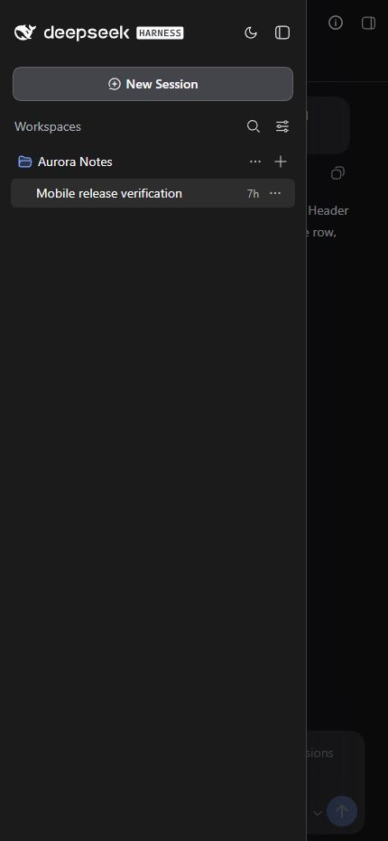
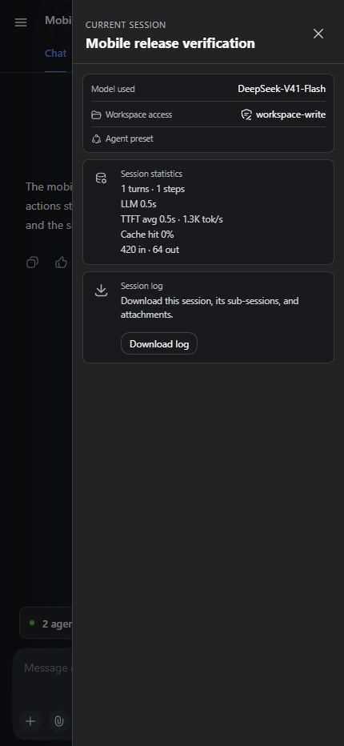
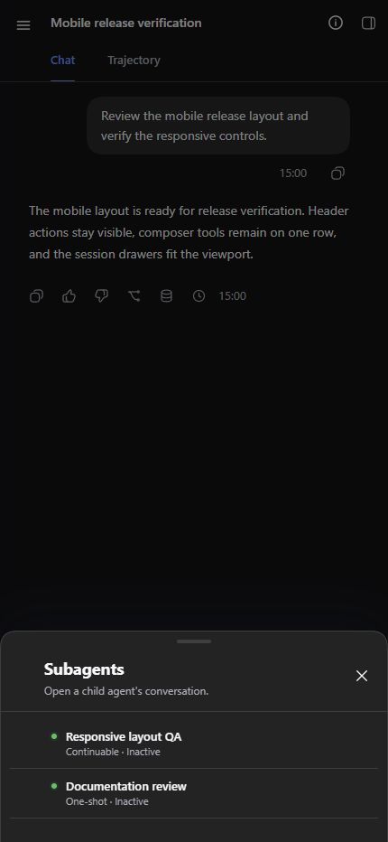
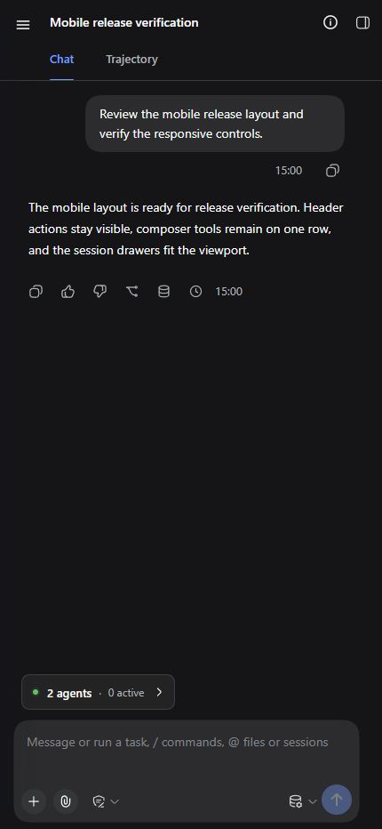

# dsh-local-link

[](https://github.com/donoteatme/dsh-local-link/actions/workflows/ci.yml)
[](https://www.npmjs.com/package/dsh-local-link)
[](https://awesome-dsh-plugin.com)
[](LICENSE)

Use the same [DeepSeek Harness](https://github.com/deepseek-ai/deepseek-harness) Web session from a phone, tablet, or another computer on your trusted private network. `dsh-local-link` adds one-time QR pairing and a responsive Mobile View to the stock DSH client—without a hosted relay, cloud account, native app, replacement chat UI, or second workspace picker.

Open `Local access`, scan the QR code, and the paired browser arrives at the desktop's currently selected Harness session with the same live conversation, permissions, workspaces, and plugin surfaces.

The `1.1.x` line supports DeepSeek Harness `0.1.5-rc.1` and keeps the stock Web client usable on narrow touch screens. It reorganizes the existing Harness interface into responsive drawers, compact session controls, and touch-friendly actions while keeping the same client, session, plugin slots, permissions, and live agent stream.

> **Security boundary:** the gateway uses plain HTTP and is intended only for a trusted private network. Do not expose its port to the internet or use it on public Wi-Fi.

<p align="center">
  
</p>

<p align="center"><sub>One Harness session, paired directly across the trusted LAN.</sub></p>

## Focused product scope

Local Link is intentionally a small LAN companion for the existing Harness Web client, not a general remote-access platform. Its purpose is to make one path dependable: open the Harness instance already running on a computer from another trusted device on the same private network, then use the same sessions and interface in a browser.

Development stays focused on:

- reliable same-LAN browser access to the current Harness Host;
- short-lived invitations and understandable paired-device lifecycle controls;
- responsive presentation of the stock client without duplicating Harness business logic;
- compatibility with registered Harness views, slots, permissions, themes, and session state;
- accessibility, localization, bounded diagnostics, and security hardening inside that boundary.

The following are deliberate non-goals:

- public-internet exposure, hosted relays, managed tunnels, or cloud accounts;
- a separate native phone or desktop application;
- a replacement chat client or fork of the Harness interface;
- independent workspace, file, or session synchronization outside Harness;
- a general-purpose remote extension runtime unrelated to opening the current Web UI.

This does not mean the plugin is finished or frozen. It means future changes should make the local browser path simpler, safer, more compatible, or easier to diagnose instead of widening the product into a different class of system.

## Install

### npm — recommended

Stop a running `dsh web` process, install the plugin into the Web profile, then start Harness again:

```shell
dsh plugin --profile web add dsh-local-link
dsh web
```

### Git clone — development checkout

Requirements: Git, Node.js 22.19+ or 24+, Corepack, and a global `dsh` installation running a verified DeepSeek Harness version from the compatibility table below.

```shell
git clone https://github.com/donoteatme/dsh-local-link.git
cd dsh-local-link
corepack pnpm install --frozen-lockfile
npm run verify
dsh plugin --profile web add .
dsh web
```

The profile points at the checkout, so rebuild after changing client code and restart `dsh web` after Host-side changes.

## Compatibility

Compatibility is checked against exact DeepSeek Harness versions—not inferred from a successful installation.

| DeepSeek Harness | Local Link status |
| --- | --- |
| `0.1.5-rc.2` | **Verified next** |
| `0.1.5-rc.1` | **Supported release** |
| `0.1.2-rc.1` | **Verified** |
| `0.1.1-rc.2` | **Verified** |
| `0.1.1-rc.1` | **Verified** |
| `0.1.0-rc.8` | **Verified** |

All six rows were checked with the packed `1.1.1` source. Every exact version passed isolated profile composition, plugin peer checks, pairing, authenticated HTTP and WebSocket traffic, immediate socket closure on revoke, and rejection of the revoked device. The `0.1.5` rows also received the current real-client responsive check at `390 × 844`; historical responsive evidence remains recorded separately. `0.1.5-rc.1` is the development baseline. `0.1.5-rc.2` is an exact `next` check, not a promise about future movement of that tag.

Only the exact versions listed above carry a compatibility claim. Alpha builds—including the removed `0.1.2-alpha.1` row—versions older than `0.1.0-rc.8`, and whatever package a moving `next` tag points to later are unsupported until checked independently. See [Compatibility](docs/COMPATIBILITY.md) for the evidence and remaining real-device boundary.

## Use

### Open Harness on another device

1. Open the session you want on the computer.
2. Click `Local access` at the bottom of the Harness sidebar.
3. Scan the QR code or copy the one-time link to another device on the same network.
4. The first browser to use the invitation opens the stock Harness client at the selected session. Host-level administration that Harness reserves for loopback remains unavailable remotely.

The invitation is one-use, expires after five minutes by default, and is replaced immediately when `Generate another code` is selected.

Phone and tablet browsers automatically receive Mobile View when the viewport is at most 834 CSS pixels wide. The same responsive behavior can be previewed with browser device emulation; no URL parameter, user-agent switch, or second client is involved.

## Mobile View

The stock Harness Web interface is difficult to operate on a phone: persistent desktop navigation consumes the viewport, session controls compete with the conversation title, several actions depend on hover or long press, and subagent information is too dense for a narrow screen. Mobile View makes that existing interface usable without introducing a second client or duplicating Harness business logic.

| Stock narrow-screen behavior | Mobile View in `1.1.x` |
| --- | --- |
| Desktop navigation competes with the conversation | Workspace and session navigation opens as a dismissible left drawer |
| Session metadata crowds the header | Context, model, access, preset, activity, and export move into a compact right drawer |
| Subagent details are difficult to scan or reach | Total/active status stays near the composer and the native catalog opens as a bottom sheet |
| Hover-oriented session and workspace actions | Overflow actions remain visible and touch-accessible |
| Session changes can summon the software keyboard | Automatic composer focus is suppressed while intentional input focus still works |
| Desktop spacing ignores phone safe areas | Header, composer, tabs, media, overlays, and scrolling adapt to narrow viewports |

The implementation changes presentation, not Harness ownership or behavior:

- the native workspace/session browser becomes a left drawer;
- dynamic Chat, Trajectory, composer, overlay, and third-party plugin slots remain intact;
- Current session opens from the header with context breakdown, model, workspace access, preset, activity, and session-log download;
- child-agent status shows total and active counts, then opens the native nested catalog as a touch-friendly bottom sheet;
- the Harness theme service powers a compact sun/moon action;
- desktop-only Settings and the nested Local access action are omitted from mobile navigation, while the appearance action remains available;
- session and active-workspace menus stay immediately available on touch screens;
- safe areas, scrollable tabs, bounded media, and virtual-keyboard behavior are adapted for narrow viewports;
- plugin-owned modal drawers contain keyboard focus and return it to the invoking control when closed;
- existing workspaces remain available, while the misleading remote `Add workspace` directory picker is omitted.

These previews are captured from the running Harness client at a `430 × 932` viewport with non-persistent sample content; the thin rounded frame is presentation-only.

| Navigation | Current session | Subagents | Conversation |
| :---: | :---: | :---: | :---: |
|  |  |  |  |

### Permissions

The remote browser inherits the selected Harness session's **Read only**, **Workspace write**, or **Full access** authority. Mobile View displays that value but does not create or weaken a permission layer. This applies to ordinary session operations; Settings, credentials, native Host actions, and agent-preset authoring remain loopback-only. Hiding `Add workspace` is a usability constraint, not an authorization boundary.

The responsive enhancements target viewports from 360 through 834 CSS pixels wide. The release matrix defines checks at `360 × 800`, `390 × 844`, `430 × 932`, and `768 × 1024`; release acceptance also requires portrait and landscape checks on a real phone. See [Mobile View](docs/MOBILE_VIEW.md) for behavior, theme persistence, compatibility surfaces, and the complete acceptance checklist.

### Manage trusted browsers

On the Harness computer, use `Paired devices` in the QR panel or open `Settings → Local access`. Each new browser starts as `My device`; its subtitle is detected automatically, for example `Phone · Chrome`, `Tablet · Safari`, or `Computer · Edge`.

- `Rename` changes display metadata only.
- `Revoke` invalidates the browser credential and immediately closes its open Local Link WebSocket connections.
- A cleared cookie, private window, new browser profile, or revoked device needs a new invitation.

Browsers do not reliably distinguish laptops from desktop computers, so both are shown as `Computer`.

<p align="center">
  
</p>

Expand `Diagnostics` on the same Settings page to inspect the most recent local gateway events. `Copy report` produces issue-ready JSON and `Clear` removes the local history. The report contains event codes, timestamps, severity, and a small allowlisted context only; it never includes pairing tokens, cookies, IP addresses, device or session IDs, device names, request paths, prompts, conversations, or project files.

<p align="center">
  
</p>

## Why it stays small

- **Stock Harness UI:** the plugin opens the existing Web client and live agent stream.
- **Local only:** one private-network gateway forwards to the loopback Harness Host.
- **Two runtime dependencies:** configuration schema support and QR generation.
- **No fingerprinting:** access is a random per-browser credential, not a device identity guess.
- **Native extension points:** sidebar and Settings content use Harness slots and locale services.
- **Native responsive enhancement:** the shipped Harness AppFrame stays mounted; registered conversation views and overlays remain dynamic.
- **JSON localization:** all visible plugin copy lives in matching locale dictionaries.
- **Local diagnostics:** a bounded, redacted event history helps debug installs without analytics or an external collector.

## How it works

```text
Desktop browser on 127.0.0.1:3080
  └─ Local access → one-use invitation
                         │
Phone / tablet / computer on the private LAN
  └─ 192.168.x.x:3088 → network + Host validation
                       → pairing or device-cookie validation
                       → HTTP / WebSocket proxy
                       → 127.0.0.1:3080 (the same Harness Host)
```

The gateway does not create a second Harness session. During first connection it transfers the desktop browser's current session selection to the new browser origin; session data and ongoing conversation events still come from the same Host.

Authorization uses a 256-bit random cookie credential. Only its SHA-256 hash is stored. The editable name and detected device/browser text never grant access.

The LAN authority is declared through Harness's official connection `trustedHosts` contract. This enables authenticated session API and WebSocket traffic without pretending that the phone is loopback. Harness `0.1.2-rc.1` and the verified `0.1.5` builds authenticate the transport as a whole, so Local Link itself rejects the configuration, credential, native Host-action, and agent-preset-authoring RPCs that earlier supported Harness builds kept loopback-only.

## Configuration

The bundled profile patch installs conservative defaults:

| Option | Default | Purpose |
| --- | --- | --- |
| `listenHost` | `0.0.0.0` | Listen on local interfaces; request validation still accepts only private/loopback sources. |
| `listenPort` | `3088` | LAN gateway port. |
| `upstreamOrigin` | `http://127.0.0.1:3080` | Existing loopback Harness Web server. |
| `accessMode` | `pairing` | Require a one-use invitation and device cookie. |
| `pairingTtlSeconds` | `300` | Invitation lifetime. |
| `deviceTtlDays` | `90` | Remembered-browser lifetime. |
| `diagnosticsEnabled` | `true` | Keep the bounded local diagnostic history. |
| `diagnosticsMaxEntries` | `15` | Maximum retained events (`5`–`200`). |
| `diagnosticsFile` | next to `stateFile` | Local JSON event store; the bundled profile uses `~/.dsh/local-link/diagnostics.json`. |

`listenHost` accepts only `0.0.0.0` or an explicit private/loopback IP literal. Public listener addresses are rejected during startup; this configuration guard complements, rather than replaces, the operating-system firewall.

`trusted-lan` disables per-device authorization and should be reserved for isolated development networks. `pairing` is the supported default because a connected Harness browser can read files, submit prompts, approve actions, and trigger commands.

The plugin never creates firewall rules. If Windows prompts for network access, allow only the **Private** network profile and never forward port `3088` on the router.

## Troubleshooting and diagnostics

Diagnostics are a local, event-driven history of failures—not a request log. The plugin retains 15 events by default, shows the newest 12, coalesces identical five-second bursts, and records nothing for successful starts, requests, pairing, copies, renames, or revocations.

For support:

1. Reproduce the failed action once.
2. Open `Settings → Local access → Diagnostics`.
3. Click `Refresh` if the panel was already open.
4. Use the newest stable event code to identify the failed boundary.
5. Click `Copy report`, review the JSON, and attach it to an issue if needed.

The report never includes secrets, addresses, IDs, names, URLs, paths, prompts, conversations, or project data and is never uploaded automatically. See the [event reference and first checks](docs/DIAGNOSTICS.md) for every tracked failure.

## Localization

Harness's active language selects the plugin dictionary; the plugin has no separate language switch.

The minimal automatic pairing page loads before Harness locale services are available. It reuses the same dictionaries and selects English or Chinese from the connecting browser's language list; English is the fallback.

| Language | Dictionary | Status |
| --- | --- | --- |
| English | `src/locales/en.json` | Included |
| Chinese | `src/locales/zh.json` | Included |

Dictionary keys are checked for parity in tests. To add a locale, copy `en.json`, translate values without changing keys, register the locale ID in `src/client.tsx`, extend the pre-client pairing-page language map in `src/gateway/pair-page.ts`, and run `npm test`.

## Development

```shell
corepack pnpm install --frozen-lockfile
npm run typecheck
npm test
npm run build
npm run verify
```

Project documentation:

- [Architecture and compatibility boundaries](docs/ARCHITECTURE.md)
- [Verified DeepSeek Harness compatibility](docs/COMPATIBILITY.md)
- [Mobile View behavior and release matrix](docs/MOBILE_VIEW.md)
- [Local diagnostics and event codes](docs/DIAGNOSTICS.md)
- [Security model](docs/SECURITY.md)
- [Contributing](CONTRIBUTING.md)
- [Security reporting](SECURITY.md)

## Known limitations

- LAN traffic is not encrypted; the current gateway uses plain HTTP.
- Revocation blocks new requests and reconnects and terminates every open Local Link WebSocket authenticated by the revoked device.
- A light/dark choice made from a remote browser is page-scoped in the supported Harness builds; reload returns to the Host preference and resolves `system` against the remote device.
- Invitations use the highest-ranked private IPv4 interface detected at startup; choosing among multiple LAN interfaces is not exposed yet.
- The shortcut that opens a specific Settings section uses a small semantic compatibility bridge because Harness does not expose a general settings-navigation service.
- Harness's footer-action container needs a compatibility layout rule when the full-width Cordis action is present.
- Mobile View targets viewports from 360 CSS pixels wide, but third-party fixed-width views, virtual keyboards, orientation changes, split-screen browsers, and operating-system text scaling still require real-device acceptance.
- Plugin-owned buttons and text inputs use Harness `Button` and `Input` primitives and their semantic variants. Harness `0.1.5-rc.1` still has no complete public responsive-shell, spacing, or radius contract, so mobile geometry, responsive compositions, and the few missing primitive icons remain documented design-system compatibility risks.

## Development disclosure

The initial implementation and documentation were developed collaboratively with OpenAI Codex. Changes remain subject to maintainer review, automated tests, security review, and the same contribution requirements as human-authored changes. No runtime AI service, telemetry, or generated-code dependency is included in the package.

## License

[MIT](LICENSE) © 2026 dsh-local-link contributors.
